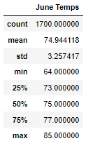
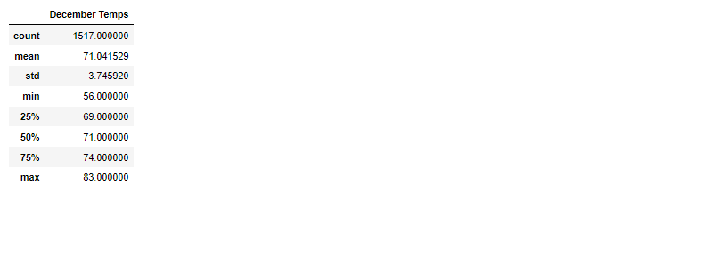

# surfs_up

## Overview of Project

The aim of this project was to determine statistical analysis for the months of June and December for Oahu. Statistical data collected will help W.Avy in making a decision on whether the surf and ice cream shop business is sustainable year-round.  

## Results

Below are snippets of all the statistics for the month of June as well as December.

June

 

As per the statistics for the month of June, we can verify that the averge weather of Oahu is relatively warm. 

December

The month of December is equally as good despite the minimum temperature being lower. The difference in standard deviation between June and December is small hence confirming that the weather is favorable for the surfs business as well as the ice cream.

## Summary

In general, the weather in June and December is fairy comparable in that the difference is not huge enough to prevent the institution of the surfs business. It is a little colder in December which suggests that the business might have to be closed on days that the weather is not conducive. On a positve note, more queries could be run to gather more data such as precipitation and the weather during holidays. This would help in making a more informed decision.  
